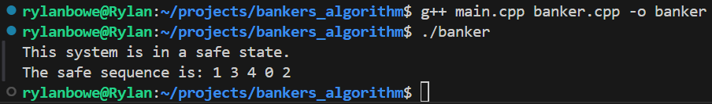

# Banker's Algorithm project for Operating Systems (CS 33211)

This project utilizes the **Banker's Algorithm** to avoid deadlock and ensure a system will never enter an unsafe state.

- a data file called **data.txt** that contains a snapshot of a system is used to simulate current system state
    - this data file contains an allocation matrix, a maximum matrix, and a vector of current available resources (i'll explain what all of this means in a later section)

## What is the Banker's Algorithm?
The banker's algorithm is a **deadlock avoidance** algorithm that is used in operating systems. The idea of this algorithm is to ensure the system is always in a safe state, and this safe state is achieved through properly allocating resources to each process in the system, and by avoiding unsafe states where deadlock is possible.

## Implementation details:
As previously mentioned, a data file is utilized to simulate system state, and before I expand on this, I should mention that we assume that this system contains five distinct processes (P0 through P4), as well as three different resource types (A, B, C). The data file (data.txt) contains 2 matrices and a vector. Rows of both matrices represent a distinct process, and columns represent a distinct resource type. Here are some things to know regarding these 3 data structures in this context:

- **Allocation Matrix**: P x R matrix(# of process and # of resources) that stores current number of resources of a given resource type allocated to each process
- **Maximum Matrix**: P x R matrix used to store maximum demand for each process in the system
- **Available Vector**: Vector of size R that is used to indicate # of available instances of each resource type

There exists a third matrix that is not present in data.txt, called the **Need** matrix, and it is used to store whatever resources a given process may still need. Need is calculated as follows:

- Need[P][R] = Maximum[P][R] - Allocation[P][R]

Two functions are used to assess current system state and they both utilize the data structures previously described:

- void calculateNeed()
    - calculates the need of all processes in the system, and the results of these calculations are stored in the need matrix I explained above
- bool safeSequence()
    - assesses current systems state: if system is in a safe state, it returns true and the safe sequence is printed. if system is not in a safe state, it returns false

## Is the system in a safe state and if yes, what is the safe sequence?
Yes, our simulated system state is safe and deadlock can be avoided. The safe sequence to ensure that each process can finish without a deadlock occuring is: **P1, P3, P4, P0, P2**

- If the processes are ran in this order, the needs of each process will be satisfied and each process will eventually get the resources that it needs

## How to compile and run:
**To compile:**
g++ main.cpp banker.cpp -o banker

**To run:**
./banker

## Expected output:

